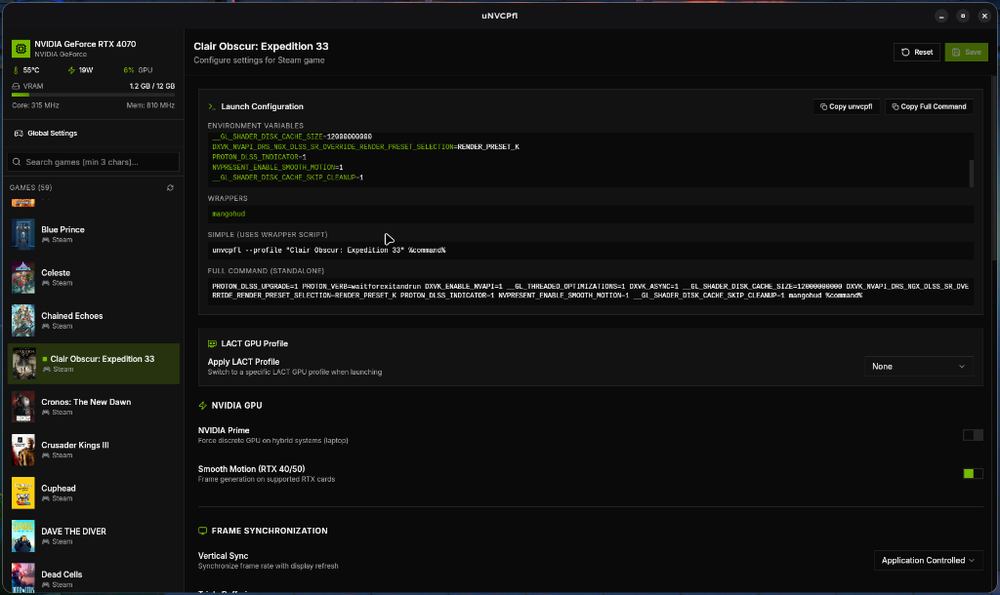

# uNVCPfL

> **Unofficial NVIDIA Control Panel for Linux**

⚠️ **Work in Progress** - This project is under active development.



A modern, user-friendly application to configure per-game graphics settings for Linux gaming. Built with Tauri, React, and Rust.

## ✨ Features

- **🎮 Game Detection** - Auto-detects games from Steam, Lutris, Heroic, and Faugus Launcher
- **⚙️ Per-Game Profiles** - Configure DLSS, DXVK, Gamescope, and more for each game
- **📊 GPU Monitoring** - Real-time NVIDIA GPU stats via NVML
- **🔌 LACT Integration** - Switch GPU power profiles per-game (if LACT is installed)
- **📋 Launch Commands** - Copy ready-to-use Steam launch options

### Supported Environment Variables

| Category | Variables |
|----------|-----------|
| **DLSS** | `PROTON_DLSS_UPGRADE`, `PROTON_DLSS_INDICATOR`, `PROTON_ENABLE_NGX_UPDATER` |
| **DXVK-NVAPI** | `DXVK_NVAPI_DRS_NGX_DLSS_*_OVERRIDE`, Render Presets, Multi-Frame Generation |
| **NVIDIA** | `NVPRESENT_ENABLE_SMOOTH_MOTION`, `__NV_PRIME_RENDER_OFFLOAD`, VSync |
| **Proton** | `PROTON_ENABLE_WAYLAND`, ESYNC/FSYNC/NTSYNC modes |
| **Wrappers** | MangoHud, Gamemode, game-performance, Gamescope, DLSS Swapper |

## 🚀 Quick Start

### Prerequisites

```bash
# Ubuntu/Debian
sudo apt install libwebkit2gtk-4.1-dev build-essential curl wget libssl-dev libgtk-3-dev libayatana-appindicator3-dev librsvg2-dev

# Arch/CachyOS
sudo pacman -S webkit2gtk-4.1 base-devel curl wget openssl gtk3 libayatana-appindicator librsvg

# Fedora
sudo dnf install webkit2gtk4.1-devel openssl-devel curl wget gtk3-devel libappindicator-gtk3-devel librsvg2-devel

# Rust
curl --proto '=https' --tlsv1.2 -sSf https://sh.rustup.rs | sh

# Node.js (via nvm)
curl -o- https://raw.githubusercontent.com/nvm-sh/nvm/v0.39.7/install.sh | bash
nvm install --lts
```

### Build & Run

```bash
# Clone the repository
git clone https://github.com/yourusername/unvcpfl.git
cd unvcpfl

# Install dependencies
npm install

# Run in development mode
npm run tauri dev

# Build for production
npm run tauri build
```

The built application will be in `src-tauri/target/release/`.

## 📖 Usage

### Using the GUI

1. **Launch uNVCPfL** - Games are automatically detected
2. **Select a game** from the sidebar
3. **Configure settings** - Toggle options, adjust values
4. **Save** - Click the Save button
5. **Copy launch option** - Use "Copy unvcpfl" or "Copy Full" button

### Using the Wrapper Script

Add to your Steam game's launch options:

```bash
# Simple method (uses saved profile)
unvcpfl --profile "Game Name" %command%

# Or copy the full command from the app
```

#### Installing the Wrapper

```bash
# Install to local bin
sudo cp scripts/unvcpfl /usr/local/bin/
sudo chmod +x /usr/local/bin/unvcpfl
```

## 🐧 CachyOS Support

This app is optimized for [CachyOS](https://cachyos.org/) with special support for:

- **game-performance** - CachyOS scheduler optimization wrapper
- **NTSYNC** - Native sync support (kernel 6.3+)
- **Optimized defaults** - Settings tuned for CachyOS gaming

Enable "Game Performance (CachyOS)" in the Wrappers section to use `game-performance`.

## 🔧 Configuration

Profiles are stored as TOML files in:

```
~/.config/unvcpfl/profiles/
├── cyberpunk_2077.toml
├── elden_ring.toml
└── global_settings.toml
```

### Example Profile

```toml
name = "Cyberpunk 2077"
steam_appid = 1091500

[dlss]
upgrade = true
indicator = false
sr_override = true
sr_preset = "render_preset_k"

[proton]
sync_mode = "fsync"
enable_wayland = false

[wrappers.mangohud]
enabled = true
fps_limit_enabled = true
fps_limit = 60
fps_limiter_mode = "late"

[wrappers.gamescope]
enabled = true
dsr_enabled = true
dsr_width = 2560
dsr_height = 1440
width = 1920
height = 1080
```

## 🔗 LACT Integration

If [LACT](https://github.com/ilya-zlobintsev/LACT) is installed, you can switch GPU power profiles per-game:

```bash
# Verify LACT is working
lact cli profile list
```

The app will automatically detect LACT and show the profile dropdown.

## 📸 Screenshots

| Feature | Description |
|---------|-------------|
| GPU Monitor | Real-time temp, power, utilization |
| LACT Profiles | Per-game GPU power profiles |
| DLSS Settings | Full DXVK-NVAPI control |
| Gamescope DSR | Dynamic super resolution |

## 🤝 Contributing

Contributions are welcome! Please feel free to submit issues and pull requests.

## 📄 License

MIT License - See [LICENSE](LICENSE) for details.

---

Made with 💚 for the Linux gaming community
